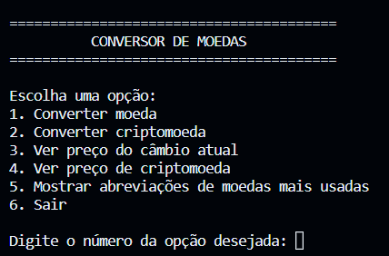

   
   

 

[**Sobre**](#-sobre) **|**
[**Screenshot**](#-screenshot-menu) **|**
[**Ferramentas Utilizadas**](#-tecnologias-e-ferramentas-utilizadas) **|**
[**Instalação**](#%EF%B8%8F-instala%C3%A7%C3%A3o) **|**
[**Desenvolvedor**](#-desenvolvedor)

## 📝 Sobre:
Este é um simples conversor de moedas que utiliza uma API para obter as taxas de câmbio.

## 📟 Screenshot Menu: 

   

## 💾 Tecnologias e Ferramentas Utilizadas:
<table>
  <tbody>
    <tr>
      <td style="font-weight: bold">Python</td>
      <td>
        <a href="https://www.python.org/" target="_blank">Download</a>.
      </td>
    </tr>
    <tr>
      <td style="font-weight: bold">API</td>
      <td>
        <a href="https://www.exchangerate-api.com/" target="_blank">Exchangerate API</a>,
        <a href="https://www.coingecko.com/pt/api" target="_blank">Coingecko API</a>.
      </td>
    </tr>
  </tbody>
</table>

## ⚙️ Instalação:

1. Clone o repositório;
2. Instale as dependências necessárias: Requests `pip install requests` e Dotenv `pip install python-dotenv`;
3. Abra o arquivo .env e insira sua <a href="https://www.exchangerate-api.com/" target="_blank">`API_KEY`</a> da Exchangerate (conversão de moedas);
4. Entre no diretório src;
5. Execute o comando `python main.py`;
6. Siga as instruções na tela;

## 💻 Desenvolvedor:

- [@LuanR44](https://github.com/LuanR44)
